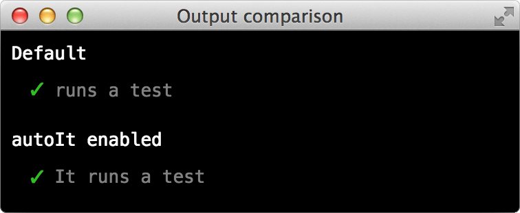
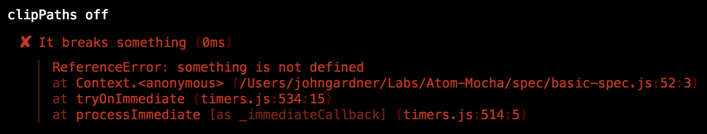
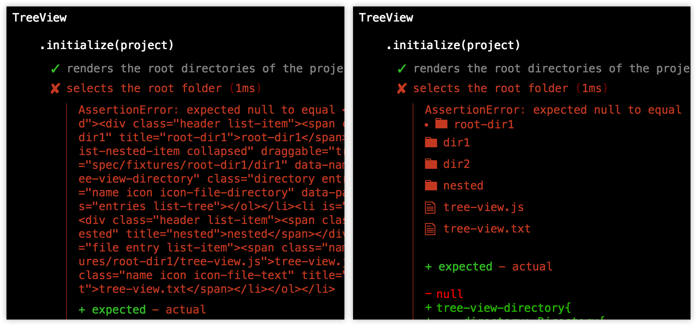
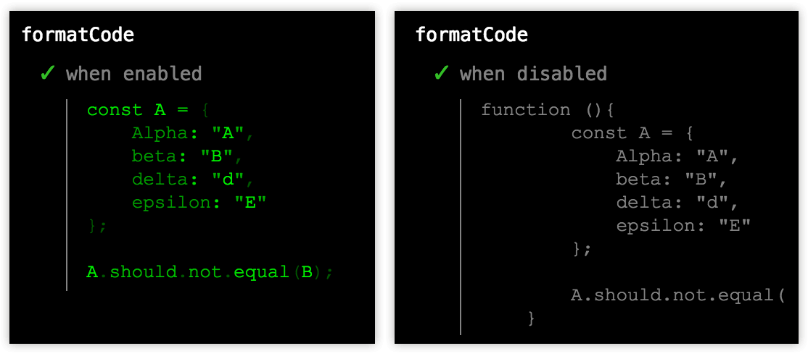
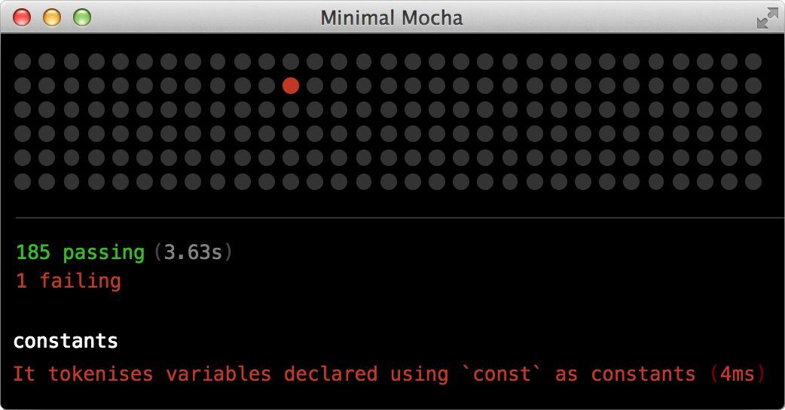
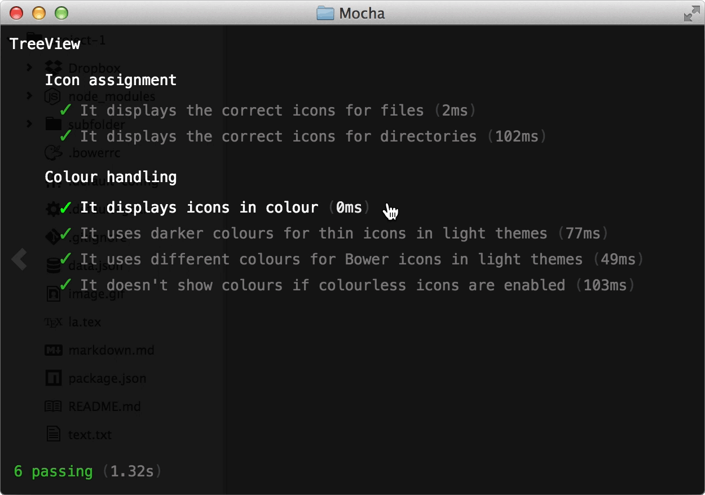

Option reference
================

Options may be specified in `package.json` or `mocha.opts`.
If duplicated, the latter takes precedence over the former.

* [headless](#headless) / [interactive](#interactive)
* [mocha](#mocha)
* [noExtensions](#noextensions)
* [optFiles](#optfiles)
* [specPattern](#specpattern)
* [tests](#tests)

**Reporter-specific:**
* [autoIt](#autoit)
* [clipPaths](#clippaths)
* [css](#css) / [js](#js)
* [escapeHTML](#escapehtml)
* [flipStack](#flipstack)
* [formatCode](#formatcode)
* [hidePending](#hidepending)
* [hideStatBar](#hidestatbar)
* [minimal](#minimal)
* [slide](#slide)
* [title](#title)


### <a name="headless">headless</a> / <a name="interactive">interactive</a>
__package.json only__  
Allows different configurations to target different environments.

For instance, perhaps you'd like headless tests to use Mocha's `landing` reporter:

```json
"atom-mocha": {
	"headless": {
		"mocha": {"reporter": "landing"}
	}
}
```

Anything that's valid for `atom-mocha` is also valid for `headless` or `interactive`.


### mocha
__package.json only__  
An object containing [Mocha configuration](https://mochajs.org/#usage) settings.
For example:

~~~json
"atom-mocha": {
	"mocha": {
		"bail": true,
		"enableTimeouts": true,
		"grep": "/(^tokenises|strings)\\b/i",
		"reporter": "landing",
		"retries": 1
	}
}
~~~

The `reporter` option defaults to whatever makes sense for the running environment.
Headless tests use Mocha's [`spec`](https://mochajs.org/#reporters) reporter, while
interactive tests use the bespoke TTY-styled reporter. These defaults are also used
if an environment doesn't support a reporter's output (such as HTML in terminal, or
monospaced/SGR-coloured patterns in interactive mode).

Note that requesting the [`dot`](https://mochajs.org/#dot-matrix) reporter will
implicitly enable the [`minimal`](#minimal) setting of the default HTML reporter.


### noExtensions
Disables the loading of `extensions.js`.
Consult the [extensions reference](./extensions.md) for details of what this entails.


### optFiles
An array of paths pointing to `mocha.opts` files to load.
Only needed if your `mocha.opts` file is located in a different directory to your specs.

__Note:__
This package is currently limited to loading one `mocha.opts` at once.
This limitation may be fixed in future to permit directory-specific configurations.


### specPattern
A regular expression that determines which files are loaded as specs.
By default, anything ending in `-spec.js` or `-spec.coffee` is treated as a spec.

If you wanted to load files with a `-test` suffix as well, you might add this to your `package.json`:

```json
"atom-mocha": {
	"specPattern": "/-(spec|test)\\.(coffee|js)$/i"
}
```

Or in `mocha.opts`:

```ini
--spec-pattern /-(spec|test)\.(coffee|js)$/i
```


### tests
__package.json only__  
An array of additional specs to load. These may be directories or individual files.

```json
"atom-mocha": {
	"tests": [
		"./spec/subfolder/",
		"./spec/adhoc.js"
	]
}
```

Paths are relative to the package's root directory.


Reporter-specific
-----------------
The following options are specific to the default reporter only; they do nothing for other reporters (such as Mocha's [HTML reporter](https://mochajs.org/#html)).

### autoIt
Prepend `It` to the name of every test.

```js
it("runs a test", () => {});
```



Only applicable when Mocha's [`ui` setting](https://mochajs.org/#u---ui-name) is set to `bdd`.


### clipPaths
__Default: Enabled__  
Make stack traces less noisy by removing the package's base directory:



To disable this in a `mocha.opts` file, use `--no-clip-paths`.


### <a name="css">css</a> / <a name="js">js</a>
Paths to extra stylesheets or scripts to attach to the spec-runner.

```json
"atom-mocha": {
	"css": "spec/assets/some custom counter.less",
	"js": [
		"node_modules/less/dist/less.min.js",
		"node_modules/annoying-nyan-cat/nyan.js"
	]
}
```

This provides an extension point for authors wishing to extend or modify the default reporter.

Paths are relative to whatever file defines them.
So to write the above example in `mocha.opts`, you'd write this:

```ini
--css assets/some%20custom%20counter.less
--js node_modules/less/dist/less.min.js node_modules/annoying-nyan-cat/nyan.js
```

Note the use of `%20` to encode spaces in the first filename.


### escapeHTML
__Default: Enabled__  
Escape `< > &` in failed assertion titles.

Generally, this is desired and expected behaviour.
Depending on what you're testing, however, it may be cleaner to show embedded HTML:



To disable this setting in a `mocha.opts` file, use `--no-escape-html`.


### flipStack
Print stack traces in reverse order, placing more recent calls at the bottom.


### formatCode
__Default: Enabled__  
Prettify the contents of embedded JavaScript snippets.



The specific effects of this option are:
* Removal of containing `function` headers
* Normalised indentation
* Syntax highlighting (using Atom's [JavaScript grammar](https://github.com/atom/language-javascript))

To disable this option in a `mocha.opts` file, use `--no-format-code`.


### hidePending
Hide all mention of [pending tests](https://mochajs.org/#pending-tests) in Mocha's output.


### hideStatBar
Hide the statbar at the bottom of the window.


### minimal
Use dots to represent each test, highlighting failures.




### slide
Allow the feedback layer to be toggled away, exposing anything added underneath (such as workspaces added with [`attachToDOM`](extensions.md#attachtodom)).



This is intended to help debug failed tests by making the DOM easier to examine.
Works well with Mocha's [`--bail`](https://mochajs.org/#b---bail).

To restrict sliding to certain edges, pass any combination of `up`, `down`, `left` and `right`.
Passing `true` will enable sliding in all directions.


### title
Title of the spec-runner window. Defaults to `"Mocha"`.
